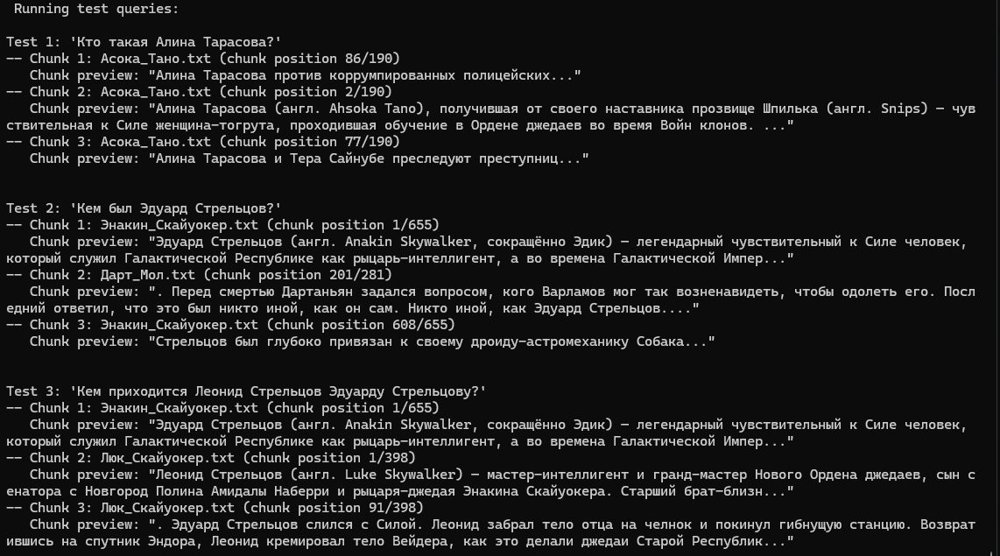

# Progect Template

## Задание 1. Исследование моделей и инфраструктуры

[Исследование моделей и инфраструктуры.md](./Task1/Исследование%20моделей%20и%20инфраструктуры.md)

## Задание 2. Подготовка базы знаний

Для получения данных необходимо установить зависимости и выполнить скрипты из директории `data`.  
Установка зависимостей:  
```shell
python3 -m pip install -r requirements.txt
```

Парсинг исходных данных:  
```shell
python3 Task2/parse_original_data.py
```
Скрипт создаст директорию `./Task2/parsed_data` и сохранит в нее 31 файл c очищенной информацией о персонажах и местах из [вики](https://starwars.fandom.com/ru/wiki/).

Далее был составлен словарь терминов и их замен `./Task2/terms_map.json`.

Для создания базы знаний нужно использовать следующий скрипт:  
```shell
python3 Task2/create_knowledge_base.py
```
Скрипт создаст директорию `./Task2/knowledge_base` и сгенерирует новые файлы c произведенными заменами терминов согласно словарю.

## Задание 3. Создание векторного индекса базы знаний

Характеристики индекса и векторной базы:
    - Модель эмбеддинга: [BAAI/bge-m3](https://huggingface.co/BAAI/bge-m3)
    - Векторная база: ChromaDB  
    - Количество чанков: 5171
    - Время генерации индекса: в среднем ~365 секунд  

Следующий скрипт построит индекс и положит в векторную базу:
```shell
python3 Task3/build_index.py
```
По итогу получим директорию `model` со скачанной моделью и директорией `chromadb` с итоговой базой. Чтобы пересоздать индекс, нужно удалить папку с базой.

Далее нужно протестировать построенный индекс. Для этого нужно использовать следующий скрипт:
```shell
python3 Task3/test_index.py
```

Пример запроса к индексу:


